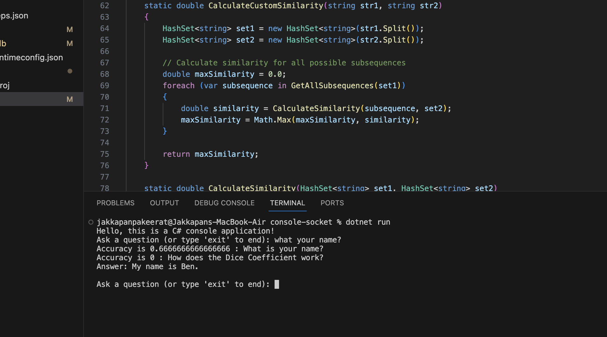

# Project Overview

Hi there! 👋 Welcome to my project, developed with the primary goal of learning and enhancing my skills. I didn't set any specific expectations for this project other than personal growth and skill improvement.

## Project Development Journey

I kicked off this project by constructing a console application to implement the core logic for chatbot algorithms. The primary objective was to create a system that could generate responses by searching for similar words within my model, ultimately finding the best answer.

## Screenshots

Here's a sneak peek at what the project looks like:

## Technology Stack

This project is implemented using **C#**, chosen for its versatility and suitability for console applications. The codebase is designed to efficiently search for relevant words in the model to craft intelligent responses.

## How to Run the Project

To experience the project firsthand, follow these simple steps:

1. Clone the repository to your local machine.
2. Open a terminal or command prompt in the project directory.
3. Run the following command:
